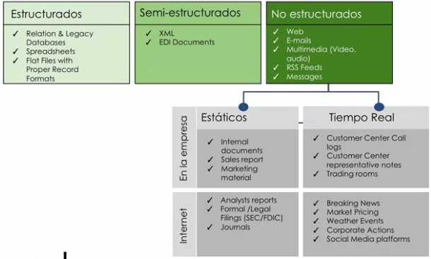

# Democratización del Big Data

* El origen de BigData se da en la digitalización. Las iteraciones con el mundo digital genera un rastro digital.
* Hay como dos internet:
    * Internet de las personas: Digitalización de la vida de las personas
    * Internet de las cosas: Digitalización de los objetos físicos.
    
* BigData trata sobre la capacidad de gestionar ingentes volúmenes de información de todo tipo. Es posible realizarlo hoy en día, ya que existe la tecnología capaz para `capturar`, `procesas`, `entender` y `accionar` toda esta información.
* La principal causa del nacimiento de BigData como mercado es la evolución tecnológica.
    * Caída dramática en los costes de procesamiento de datos.
    * Caída dramática en los costes de almacenamiento de datos.
    
## Las 3V's del Big Data
* **VOLUMEN**: Cantidad de información que se generan en el mundo digital.
* **VELOCIDAD**: podemos analizar datos, casi a tiempo real.
* **VARIEDAD**: Varios tipos de datos
  * 
* Existe una 4ta V ¿Dónde está realmente el `valor`?
    * "El conjunto es más potente que la suma de las partes"
    * BigData solo tiene sentido si el resultado de descubrir los patrones, nos lleva a descubrir a tomar decisiones de impacto en el negocio.
