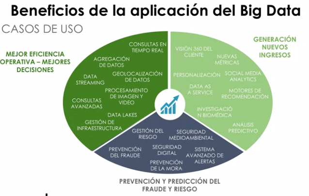

# Toma de decisiones basadas en datos

* Más importante que saber que es Big Data es saber para que queremos Big Data.
* El rol más importante va a ser disponibilizar los datos para toda la organización.
* Big Data nos permite poner el dato en el centro de la estrategia corporativa del negocio. Data Lakes.

