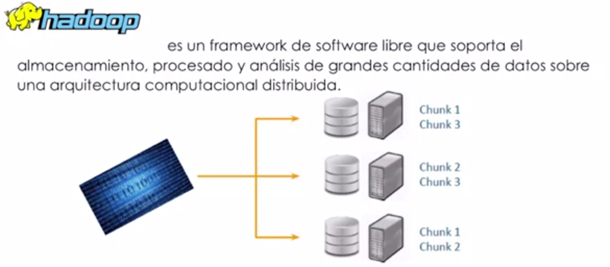
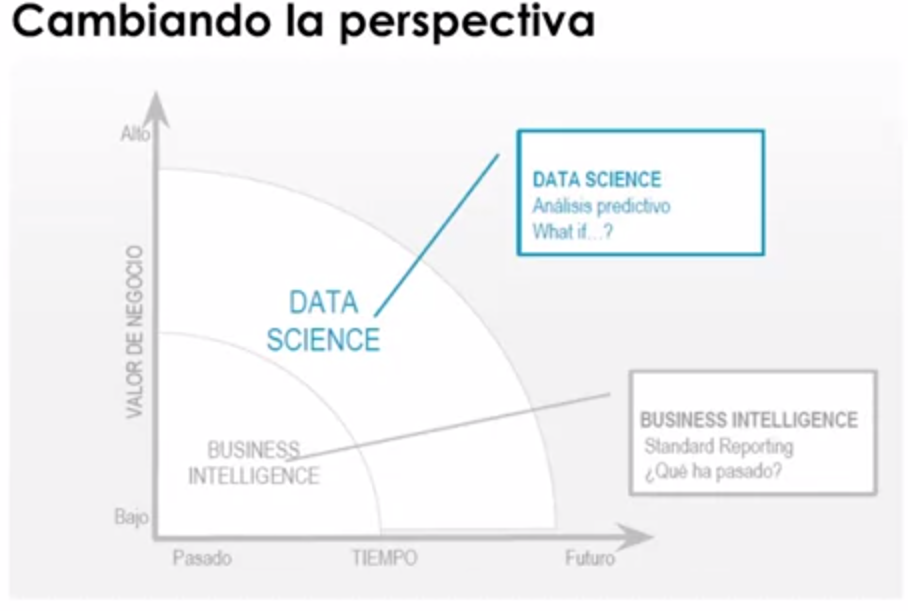
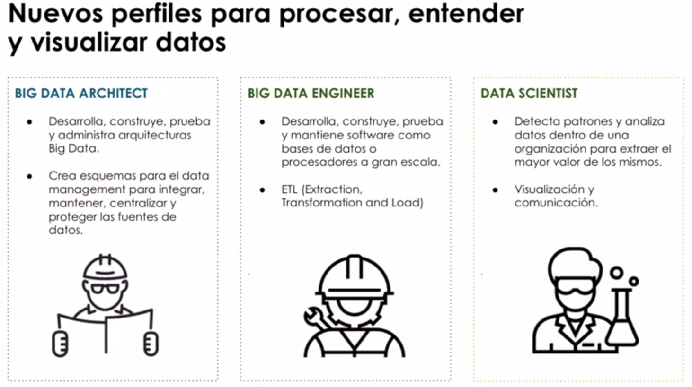

# ¿Qué necesitamos para obtener el máximo valor de los datos?
* Debemos de resolver 5 grandes **retos**.

## Nuevas arquitecturas tecnológicas
* Las arquitecturas de información que tenemos actualmente no son suficientes.
* Los sistemas de información de las empresas, en su mayoría, permiten gestionar aplicaciones con datos estructurados, no son capaces de procesar toda la información no estructurada y toda la nueva información como consecuencia de la explosión de datos digital,  y tampoco son capaces de poderle hacer y poder escalar con grandes volúmenes a bajo coste.
* Necesitamos incorporar nuevas arquitecturas Big Data a nuestros sistemas.

* Por lo tanto, big data requiere nuevas arquitecturas tecnológicas basadas en el framework hadoop que fue el framework básico que hoy día ha evolucionado a otros componentes como pueden ser Spark.
* Lo más importante de entender que estas arquitecturas big data complementan y en algunos casos pueden sustituir a los sistemas de información tradicional como los data warehouse.
* Para poder hacer eso contamos con muchos componentes. La gran dificultad también de big data es poder seguir el ritmo de la innovación tecnológica. El sistema de partners es inmenso, pero la buena noticia es que existe software disponible a muy bajo coste para resolver cualquier problema y cualquier caso de uso, pero lo más importante es entender que te tienes que basar en una especie de componentes básicos para que todo eso pueda evolucionar a lo largo del tiempo a pesar de la innovación constante. Y esas piezas básicas va a ser hadoop para lo que sería las latencias en batch y Spark probablemente a nivel de tiempo real, aunque todos esos sistemas también están avanzados

## EL Business Intelligence no es suficiente
* El business intelligence se basa en poder analizar la información del pasado en base a unos entornos cerrados que son los data warehouse y únicamente para poder dar respuestas a preguntas conocidas. Ahora entorno de business intelligence no le puedes preguntar algo que no hubieras pensado antes.
* La ventaja de evolucionar del business intelligence a la analítica avanzada del big data, lo que llamamos el data science es poder dar respuestas a preguntas conocidas pero también a preguntas no conocidas. Porque big data nos permite descubrir los patrones ocultos que hay detrás de la información. Por lo tanto la analítica avanzada y el data science nos permite pasar de gestionar nuestras empresas desde el presente hacia atrás con el retrovisor lo que you ocurrió y por lo tanto lo que you no puedo hacer nada con ello, que es el business intelligence del pasado, a lo que es la analítica avanzada del futuro que es del presente hacia adelante..

  
## Nuevos perfiles y habilidades del capital humano

* Existen tres nuevas profesiones que son claves para desplegar big data
  * El `arquitecto big data` que es quién tiene que desplegar, mantener y diseñar las arquitecturas de big data capaces para poder procesar y analizar esta información de todo tipo de múltiples fuentes.
  * El `ingeniero big data` que es el que se encarga de provisionar las fuentes de datos tantas internas como externas y de prepararlas para su análisis. 
  * El `científico de datos` que es quien va a ser capaz de aplicar técnicas analíticas avanzadas, machine learning, big learning, en el futuro inteligencia artificial para poder desarrollar patrones y algoritmos predictivos que llevan a tomar y dar valor al negocio.
  * Otra figura también muy importante es el del `visualizador de datos`, que es que nos va a ayudar a poner los datos de tal manera que la mente humana las pueda capturar, las pueda entender y las pueda accionar.

    
## Eliminar la falta de normas y nuevas metodologías

* Cuando estamos hablando de big data, hablamos de poder disponibilizar todos los datos a la organización en lo que llamamos los data lakes, los lagos de datos. Sacar la información de los hilos y ponerla en el mismo sitio, independientemente de su formato, independientemente de donde vengan para poderlos tener accesibles a todo el negocio y a partir de ahí desarrollar nuestra estrategia de análisis.
*  los lagos de datos deben de estar gobernados porque si no serían vertederos de datos con muchos riesgos a nivel legislativo, sino sabemos quién hace qué con los datos en cada momento. Por lo tanto necesitamos definir políticas de gobierno y políticas de seguridad alrededor de los datos, a nivel corporativo y que se implementan en procesos a nivel técnico que tienen que ver con la manera que nosotros vamos a gestionar los entornos de desarrollo de los modelos y también los entornos productivos de esos modelos analíticos.

## Marcar una priorización de los casos de uso

* lo primero que deberíamos hacer en cualquier organización es identificar los casos de uso de negocio. ¿Para qué quiero big data? ¿Para qué lo quiere el departamento comercial, para qué lo quiere el departamento financiero, para qué lo quiere el departamento de producción o el de logística?
* Y una vez tengamos todas las necesidades de big data y todos los casos de uso potenciales, debemos priorizarlos en base a las prioridades de negocio. Y es solamente cuando tenemos esa hoja de ruta, ese road map de los casos de uso priorizados, cuando podemos desplegar nuestras estrategias de provisionamiento de datos y de arquitectura, porque la arquitectura big data es una arquitectura bottom up, se construye de abajo a arriba a partir de los casos de uso.
* Negocio debe priorizar los casos de uso y deben ser los departamentos de tecnología, los de provisionamiento de datos y los analíticos los que deben desarrollar estrategias después de que negocio haya definido sus prioridades.