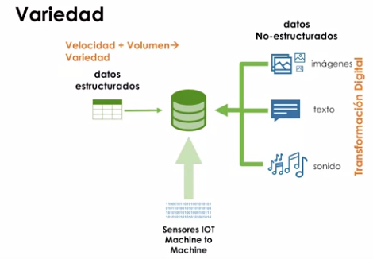
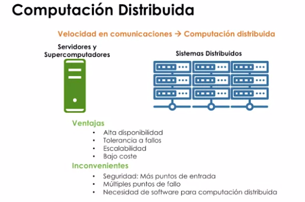
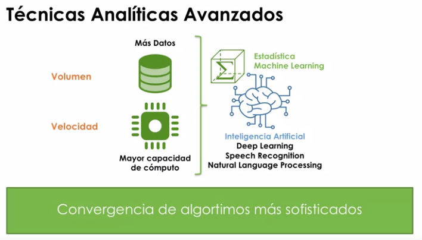

# ¿Qué es Big Data?

> **Objetivo**: Describir el Big Data y mostrar los cambios que se están produciendo en el tratamiento de la información

## Analítica tradicional

* El analista/científico coge información de bases de datos o de ficheros y mediante técnicas analíticas obtiene modelos analíticos que puede utilizar en negocio, investigación o el ámbito en el que trabaje. Para ello puede utilizar servidores o supercomputadoras si necesita capacidad de cómputo elevada.

## Analítica avanzada

* Con el Big Data podemos almacenar muchísima más información. El coste de almacenamiento se ha reducido notablemente.
  * En 1992 con 500$ podíamos adquirir ~1 GB de almacenamiento.
  * En la actualidad con 500$ podemos adquirir ~26 Terabytes(26000GB) de almacenamiento.
  * Cada año se multiplica la capacidad de los microprocesadores(Ley de Moore). Lo que permite que se pueda procesar muchísima información en mucho menos tiempo y con algoritmos más potentes.
  * También están evolucionando las CPU, GPU, TPU, ...

  
* `Computación distribuida`: Gracias a que la velocidad de las comunicaciones ha aumentado se está cambiando el paradigma de la computación.
  * Pasamos de una computación centrada en servidores y supercomputadoras a una computación centrada en sistemas distribuidos.
    

## Las V's del Big Data

* `Volumen`: Mucha información
* `Velocidad`: Procesarlas rápido
* `Variedad`: diversos tipos
* Retos del Big Data:
  * `Valor`: ¿Cómo se puede extraer valor de toda la información disponible?
  * `Veracidad`: ¿Cómo se puede asegurar la veracidad de la información capturada?
  * `Vizualización`: ¿Cómo se puede mostrar los resultados de forma clara, sencilla y veraz?
  * `Variabilidad`: ¿Cómo se puede mantener los procesos y análisis en un entrono tan variable?

## Principales retos del Big Data 

* Complejidad tecnológica
* Complejidad Algorítmica: Necesidad de Algoritmos de computación paralela
* Equipos multidisciplinares
* Conocimiento Experto: Aplicación en todas las industrias.

Es necesaria una Metodología de Procesamiento Big Data

